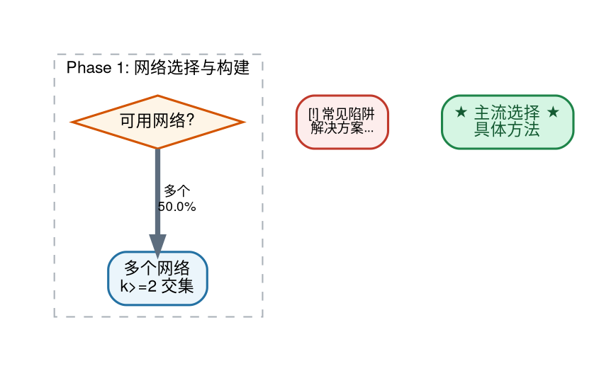

# Workflow Extraction: 从论文聚类到可复用方法论

## 核心目标

从一组聚类后的论文推理链中，提取出**可复现、可迁移的通用方法论**，产出两个核心制品：

1. **学术综述文章（LaTeX/PDF）**：
   - 完整的方法论描述（含数学公式、参数配置、可执行细节）
   - 决策流程图（Graphviz 生成的矢量 PDF）
   - 工具推荐、参数指南、应用案例、常见陷阱（四种彩色框）
   - 标准参考文献列表

2. **面向 agent 的 skill set**（可选）：
   - 结构化的阶段定义
   - 每阶段的输入输出接口
   - 可直接调用的工具链

**质量标准**：读者能够根据综述文章**独立复现**该 workflow，无需回溯原始论文。

## 适用场景

用户提供了一组来自多篇论文的推理链（reasoning chains），这些链已被聚类算法归为同一簇，
代表着"解决同一类问题的不同方法实例"。目标是从中提取一个 universal workflow。

## 输入结构预期

```
cluster_N/
├── selected_chains.json    # 被选中的推理链列表（chain_id, paper_id, distance）
├── workflow.json            # 可选：已有的初步 workflow 总结
├── xml/                     # 每篇论文的完整推理链（含所有 conclusions）
│   ├── {paper_id}_{chain_idx}.xml
│   └── ...
└── md/                      # 论文原文 markdown
    ├── {paper_id}.md
    └── ...
```

## 执行流程概览

整个提取过程分为 7 个阶段，每个阶段有明确的输入、输出和决策点：

```
Phase 1: 结构探查（5 分钟）
  → 确认输入文件完整性，生成论文清单

Phase 2: 链条质量评估（10 分钟）
  → 将链条分为 A/B/C 三类，判断素材充分性

Phase 2.5: 子主题检测（大聚类必做）
  → 检测是否需要分裂为多个子 workflow

Phase 3: 深度阅读（15 分钟/子 workflow）
  → 提取方法机制、可执行细节、主线/旁支分类

Phase 4: 提取 Workflow 阶段（10 分钟）
  → 归纳出各阶段的核心算法和接口

Phase 5: 撰写综述（30 分钟）
  → 生成 LaTeX 文档（含公式、表格、彩色框、参考文献）

Phase 6: 生成决策流程图（10 分钟）
  → 用 Graphviz 生成矢量 PDF 流程图

Phase 7: 编译与交付（5 分钟）
  → XeLaTeX 编译，生成最终 PDF
```

**总耗时估算**：单个 workflow 约 1-1.5 小时（不含大规模聚类的分裂处理）。

---

# 详细执行指南

## Phase 1: 结构探查（5 分钟）

**目标**：确认输入文件完整性，建立论文清单。

**操作步骤**：
1. **列目录**：`ls` cluster 文件夹，确认 xml/、md/、selected_chains.json 存在
2. **读 selected_chains.json**：获取被选中的 chain_id 列表和 distance
3. **读 workflow.json**（若存在）：了解已有的初步总结
4. **扫描论文标题**：`head -5 md/*.md` 快速获取每篇论文的标题和作者

**产出**：一张论文清单表（paper_id → 标题 → 被选中的 chain 编号）

---

## Phase 2: 链条质量评估（10 分钟）

**目标**：判断每条推理链的粒度和可用性，确保素材充分。

**评估维度**：

| 维度 | 好的链 | 差的链 |
|------|--------|--------|
| **目标完整性** | 描述了从输入到输出的多步骤组合 | 只定义了一个数学公式或单个技巧 |
| **工具组合性** | 涉及多个不同工具/算法的串联 | 仅一个工具的参数说明 |
| **可迁移性** | 其他数据集/场景可复用 | 高度特化于一个具体实验 |

**分类标准**：
- **A 类（粒度合适）**：描述了完整的多步骤 pipeline 或端到端实验流程
- **B 类（中间地带）**：描述了 pipeline 中某个阶段的完整操作但不是全流程
- **C 类（过于原子化）**：本质上是单个工具/公式/技巧的定义

**决策点 1——素材充分性**：
- A 类链 ≥ 3 条 → 继续，有足够素材
- A 类链 < 3 条但 A+B ≥ 5 → 继续，但 B 类链作为阶段内案例而非全流程案例
- A+B < 5 → 警告用户素材可能不足，建议扩大聚类或引入更多论文

**产出**：向用户报告评估结果，给出分类和判断。

---

## Phase 2.5: 子主题检测与分裂决策（大聚类必做）

**目标**：检测聚类是否包含多个独立的子主题，决定是否需要分裂为多个 workflow。

**触发条件**：链条数量 > 20 或 A 类链 > 8

**检测步骤**：

1. **对 A 类链按"输出类型"分组**：
   - 输出是**排序后的基因列表**→ 基因排序类
   - 输出是**一组连通子图/模块**→ 模块发现类
   - 输出是**网络本身**→ 网络构建类
   - 输出是**富集通路列表**→ 通路分析类
   - 输出是**预测值（表达/表型）**→ 预测模型类

2. **判断子主题间关系**：
   - 上下游关系（如网络构建→基因排序）→ 可合并为一个 workflow 的不同阶段
   - 并列关系（如基因排序 vs 模块发现）→ 目标和算法范式不同，应分裂
   - 包含关系（如通路分析是模块发现的子集）→ 合并到更大的子主题

3. **决策点 2——是否分裂**：
   - 最大子主题覆盖 ≥ 70% A 类链 → 不分裂，少数异类降级为 B 类
   - 有 2+ 个子主题各自 ≥ 3 条 A 类链 → 分裂为多个 workflow
   - 分裂后每个子 workflow 独立执行 Phase 3-7

**产出**：向用户报告识别出的子主题列表（名称 + A 类链 IDs + 核心范式一句话）、推荐的合并/分裂方案，等待用户确认后再继续。

**分裂后的执行策略**：
- 为每个子 workflow 创建独立的输出目录（如 `workflow_A_gene_prioritization/`）
- Phase 3-5 可用 subagent 并行执行（每个子 workflow 一个 subagent）
- Phase 6-7 每个子 workflow 独立生成流程图和 PDF
- B 类链按内容就近分配到最相关的子 workflow 作为阶段内案例
- C 类链同理降级为技巧示例

---

## Phase 3: 深度阅读（15 分钟/每个子 workflow）

**目标**：从 A 类链的来源论文中提取**可复现级别**的方法细节。

**阅读范围**：只对 A 类和部分 B 类链的来源论文做深度阅读。

**阅读步骤**：

1. 读取完整 XML 文件（不仅是被选中的那条链，而是该论文的所有 conclusions）
2. 关注以下信息并做笔记：
   - **具体参数值**（如 α=0.75, 迭代 50 次, 阈值 1.65）
   - **工具名和版本**（如 NetworkX, scikit-learn, Cytoscape）
   - **输入输出规格**（如"2,794 节点 × 18,202 边 → 39 个子网络 → 合并为 6 个"）
   - **微妙之处 / 反直觉发现**（如"简单并集不优于单一最佳"）
   - **验证方式**（如"度保持随机化 50 次 → robust Z-score"）
3. 读 md/ 中论文原文的 Methods 部分补充细节

### 3.1 方法机制描述精度要求

在记录每个方法时，避免使用过于笼统的术语。具体要求：

**❌ 避免的模糊描述**：
- "基于拓扑的方法" → 具体是什么拓扑算法？Random Walk? PageRank? Graph Cut?
- "差异分析 + 网络" → 用了哪些差异分析工具？如何映射到网络？
- "富集分析" → 用的是 Fisher 精确检验？超几何分布？GSEA？

**✅ 推荐的精确描述**：
- 算法全名：Random Walk with Restart (RWR)，不是"网络传播"
- 具体工具链：edgeR + DESeq + NBPSeg（8 种 DE 工具），不是"DE 分析"
- 数学机制：NodeRule: Qvalue(i) < threshold + EdgeRule: cor(i,j)×reg(i,j) > threshold
- 参数及其含义：λ=0.5（重启概率，控制局部性 vs 全局性的平衡）

**通用原则（适用于所有领域）**：
1. **算法层面**：写出算法的完整名称和核心数学形式
2. **工具层面**：列出具体软件/包/函数名（如 NetworkX, scikit-learn, WGCNA）
3. **参数层面**：记录参数值及其物理/领域含义
4. **数据流层面**：输入格式 → 中间表示 → 输出格式（含维度）
5. **校准层面**：零模型构建方法、统计检验类型、多重检验校正方法

### 3.2 主线方法 vs 旁支方法分类

在阅读时判断每个方法是"主线方法"还是"旁支方法"：

**主线方法**（应作为 workflow 核心阶段）：
- 适用于该问题类型的大多数场景（≥70% 的典型案例）
- 输入输出接口标准化，易于与其他阶段组合
- 有成熟的软件实现和广泛的文献支持

**旁支方法**（应标注为"特定场景的变体"）：
- 仅在特定数据类型/场景下适用（如"仅适用于多队列整合"、"仅适用于单细胞数据"）
- 需要特殊的输入格式或依赖罕见的先验知识
- 算法复杂度显著高于主流方法但性能提升有限
- 文献中作为"对比方法"而非"推荐方法"出现

**标注方式**：
- 主线方法：直接写入对应的 workflow 阶段
- 旁支方法：在该阶段末尾的"方法变体"小节中列出，注明适用场景和限制

### 3.3 可执行细节检查清单（Methods 部分重点）

阅读论文 Methods 部分时，特别关注以下可执行细节（适用于所有领域）：

**数据预处理**：
- [ ] 输入数据的质量控制标准（如缺失值处理、异常值过滤）
- [ ] 标识符映射策略（基因 ID 转换、化合物名称标准化、材料编号映射等）
- [ ] 归一化方法（log 转换、Z-score、quantile normalization 等）

**参考数据/网络**：
- [ ] 数据库版本和时间戳（如 STRING v11.5, PubChem 2023-01, ICSD Release 2024）
- [ ] 边/关系的类型和置信度阈值（如 PPI confidence > 0.4, 相关系数 > 0.7）
- [ ] 组织/条件特异性（如脑组织特异性网络、高温条件下的相图）

**偏差控制**：
- [ ] 度/连接数偏差校正（如度保持随机化、hub penalty）
- [ ] 文献偏差校正（如已知条目下采样、text-mining score 归一化）
- [ ] 批次效应校正（如 ComBat, limma removeBatchEffect）

**统计推断**：
- [ ] 零模型构建方法（如度保持随机化、标签置换、bootstrap）
- [ ] 显著性检验类型（如 permutation test, Wilcoxon, t-test）
- [ ] 多重检验校正（如 Bonferroni, Benjamini-Hochberg FDR, q-value）
- [ ] 置信区间估计（如 bootstrap 95% CI, 贝叶斯后验区间）

**验证策略**：
- [ ] 交叉验证方案（如 5-fold CV, leave-one-out, time-series split）
- [ ] 外部队列/数据集验证（独立实验、公开数据集、文献报道）
- [ ] 敏感性分析（参数扫描、子集分析、鲁棒性检验）

**注意**：不是所有论文都会包含所有细节，但 A 类链的来源论文通常会包含大部分。记录你找到的所有细节。

**产出**：每篇 A 类论文一段结构化笔记（含方法机制精确描述 + 可执行细节）

---

## Phase 4: 提取 Workflow 阶段（10 分钟）

**目标**：从 A 类链中归纳出 workflow 的各个阶段，建立阶段间的接口契约。

通常遵循：

```
输入准备 → 核心处理 → 结果整合 → 校准/验证 → 评测
```

每个阶段需确定：
- **阶段名称**（动词短语，如"网络选择与构建"）
- **核心算法/公式**（必须有数学表达，不能只有文字描述）
  - 算法全名（如 Random Walk with Restart，不是"传播算法"）
  - 关键数学形式（如 $p^{(t+1)} = (1-\lambda)Mp^{t} + \lambda p^{0}$）
  - 参数的物理/领域含义（如 λ=0.5 控制局部性 vs 全局性平衡）
  - 具体实现工具（如 NetworkX, igraph, 自实现）
  - 主线方法和旁支方法分别标注（参见 Phase 3 分类标准）
- **哪些论文的哪条链覆盖了这个阶段**

**检查**：
- 每个阶段至少有 2 篇不同论文的证据支持
- 阶段间的输入输出接口清晰
- 没有遗漏关键的校准/验证步骤

## Phase 5: 撰写综述（30 分钟）

**目标**：生成完整的 LaTeX 综述文档，使读者无需回溯原始论文即可复现 workflow。

### 5.1 文档结构模板

```latex
\section{引言}
  \subsection{问题界定}
    - 核心困难 3 点
  
  \subsection{通用范式}
    - 文字描述 workflow 的 N 个阶段
    - 引用决策流程图：见图~\ref{fig:flowchart}
    
    \begin{figure}[h]
    \centering
    \includegraphics[width=\textwidth]{flowchart.pdf}
    \caption{[Workflow 主题名称]决策流程。橙色菱形为决策节点...（完整图注见 Phase 6）}
    \label{fig:flowchart}
    \end{figure}
    
    - 阶段列表（enumerate 环境）
  
  \subsection{覆盖论文表}
    - 表格列出所有 A 类链的来源论文

\section{阶段 N: [阶段名]}  % 对每个阶段重复
  \subsection{原理与公式}
    - equation 环境，带编号
  
  \subsection{方法变体对比}
    - 表格对比不同方法
  
  \subsection{具体数值结果}
    - 来自论文的定量发现
  
  \begin{toolbox}     % 绿框：推荐工具
  \begin{parambox}    % 蓝框：关键参数
  \begin{casebox}     % 橙框：应用案例（含具体参数和输出数字）
  \begin{pitfallbox}  % 红框：常见陷阱（场景→问题→解决）

\section{结论}
  - 3 个最容易被忽视的重要结论

\section{参考文献}
  - 列出所有 A 类链来源论文的完整引用
  - 格式：[序号] 作者. 标题. 期刊名, 年份, 卷(期): 页码.
  - 或使用 BibTeX（需要 .bib 文件和 \bibliography{} 命令）
```

**关键要求**：
- **决策流程图必须放在"引言 → 通用范式"小节中**，紧跟文字描述之后、阶段列表之前
- 这样读者在了解问题背景后，立即看到完整的决策流程全景图，再深入各阶段细节
- 图片使用 `\includegraphics[width=\textwidth]{flowchart.pdf}` 嵌入矢量 PDF
- 图注要完整（见 Phase 6 的图注模板）

### 5.2 写作原则（必须遵守）

1. **全文统一使用中文**：综述正文、章节标题、图表标题、彩色框内容全部用中文撰写。专业术语首次出现时给出英文原文，如"度保持随机化（degree-preserving shuffle）"、"随机游走重启（Random Walk with Restart, RWR）"。LaTeX 文档类、包名、命令保持英文。
2. **每个公式必须定义所有符号**：不留未定义的变量
3. **每个表格必须有标题和交叉引用**：`\label{tab:xxx}` + 正文中 `表~\ref{tab:xxx}`
4. **四种彩色框嵌入每个阶段末尾**，不要单独设"工具汇总"或"陷阱汇总"章节
5. **案例框必须包含具体数字**：网络规模、样本量、参数值、输出数量、运行时间
6. **陷阱框必须包含"→"后的解决方案**：不能只说"注意"而不说怎么办
7. **方法描述必须精确到可复现级别**：
   - 每个方法首次出现时给出完整算法名称和核心公式
   - 在参数框（parambox）中列出所有关键参数及其物理/领域含义（不只是数值）
   - 在案例框（casebox）中给出具体实例的完整参数配置（不只是结果数字）
   - 避免"基于网络"、"拓扑感知"、"数据驱动"等模糊术语，除非后面紧跟具体算法名
   - 旁支方法在对应阶段的"方法变体"小节中列出，注明适用场景和限制
8. **可执行细节必须包含**（来自论文 Methods 部分的关键信息）：
   - **数据预处理**：质量控制标准、标识符映射策略、归一化方法
   - **参考数据**：数据库版本/时间戳、关系类型和置信度阈值、条件特异性说明
   - **偏差控制**：已知偏差来源和校正方法（度偏差、文献偏差、批次效应等）
   - **统计推断**：零模型构建、显著性检验类型、多重检验校正（FDR/Bonferroni）、置信区间
   - **验证策略**：交叉验证方案、外部队列验证、敏感性分析
   - 这些内容根据 Phase 3 笔记中的发现，嵌入到对应阶段的 parambox 和 pitfallbox 中
9. **LaTeX 中文支持**：
   - 使用 `\documentclass{article}` + `\usepackage{fontspec}` + `\usepackage{xeCJK}`
   - 设置中文字体：`\setCJKmainfont{Droid Sans Fallback}` 或其他系统可用的中文字体
   - 用 `xelatex` 编译（不是 `pdflatex`）
   - 彩色框标题用中文：`title={推荐工具}`、`title={关键参数}`、`title={应用案例}`、`title={常见陷阱与解决方案}`

10. **参考文献格式**：
   - 在正文中引用论文时使用 `\cite{key}` 或上标形式（如"m⁶A-Driver\textsuperscript{[1]}"）
   - 在文末添加 `\section{参考文献}` 或使用 BibTeX
   - 每篇参考文献格式：`[序号] 作者. 标题. 期刊名, 年份, 卷(期): 页码.`
   - 示例：`[1] Zhang Y, et al. m⁶A-Driver: Identifying context-specific mRNA m⁶A methylation-driven gene interaction networks. PLoS Comput Biol, 2016, 12(11): e1005287.`
   - 作者超过 3 人时用"et al."缩写
   - 从论文 markdown 文件的开头提取完整的标题、作者、期刊信息
   - 如果 markdown 文件中没有完整信息，从 XML 文件的 metadata 中提取

### 5.3 四种彩色框的 LaTeX 定义

```latex
\newtcolorbox{toolbox}[1][]{
  colback=green!3, colframe=green!40!black, breakable,
  fonttitle=\bfseries\sffamily, title={推荐工具}, #1}
\newtcolorbox{parambox}[1][]{
  colback=blue!3, colframe=blue!40!black, breakable,
  fonttitle=\bfseries\sffamily, title={关键参数}, #1}
\newtcolorbox{casebox}[1][]{
  colback=orange!4, colframe=orange!50!black, breakable,
  fonttitle=\bfseries\sffamily, title={应用案例}, #1}
\newtcolorbox{pitfallbox}[1][]{
  colback=red!3, colframe=red!50!black, breakable,
  fonttitle=\bfseries\sffamily, title={常见陷阱与解决方案}, #1}
```

## Phase 6: 生成决策流程图（10 分钟）

**目标**：生成专业的矢量决策流程图，直观展示 workflow 各阶段的方法选择和使用率分布。

**强烈推荐用 Graphviz (`dot`) 而非 matplotlib**。Graphviz 是专业的有向图自动布局工具，
处理复杂流程图时节点不重叠、箭头不交叉，视觉效果比手动坐标的 matplotlib 好得多。

### 6.1 为什么不用 matplotlib
- 手动计算每个节点的 `(x, y)` 坐标在节点数量 > 15 时极其繁琐
- 箭头路径容易穿过其他节点，难以调整
- 一旦节点文字长度变化，所有坐标都要重算

### 6.2 Graphviz 工作流

1. **写 `flowchart.dot`** — 声明节点和边，不写坐标
2. **编译**：`dot -Tpdf flowchart.dot -o flowchart.pdf`
3. **矢量 PDF 直接 `\includegraphics` 嵌入 LaTeX**，无需中间 PNG

### 6.3 dot 文件模板



### 6.4 颜色约定

| 用途 | 背景色 | 边框色 | 形状 |
|------|--------|--------|------|
| 输入节点 | `#D6EAF8` | `#2C3E50` | rounded box |
| 决策菱形 | `#FEF5E7` | `#D35400` | diamond |
| 操作步骤 | `#EBF5FB` | `#2471A3` | rounded box |
| 主流选择（高亮） | `#D5F5E3` | `#1E8449` | rounded box |
| 陷阱警告 | `#FDEDEC` | `#C0392B` | rounded box |
| 输出节点 | `#F4ECF7` | `#6C3483` | rounded box |

### 6.5 字符编码注意事项

即使 Graphviz 支持 UTF-8，也**不要在节点文字中使用特殊 Unicode 字符**，因为有些字体
（如 PingFang HK）缺失某些字形：
- ⚠ → `[!]`
- ⁻¹ → `^(-1)`
- ≥ → `>=`
- → → `->` 或中文"到"
- α, β → `alpha`, `beta`（若论文要用希腊字母，放在 label 的纯 ASCII 部分）

### 6.6 Phase 分支概率的标注原则

**统一使用"使用率"（usage rate）概念**，分母 = 该 workflow 的 A 类链数。
不要混用"互斥分支概率"和"使用率"两种标注体系——会让读者困惑。

**定义**：某个分支的使用率 = 采用该分支的 A 类链数 / A 类链总数。

**关键性质**：
- 一项研究可同时采用多种方法（如同时做 bootstrap + 度保持随机化做校准）
- 因此**同一 Phase 内各分支加和可能超过 100%**
- 保留一位小数（如 58.3%），避免假精确

**边粗细与使用率成正比**（penwidth 1.0–4.5）：
```dot
edge1 [label="★ 主流 ★\n58.3%", penwidth=4.5, color="#1E8449"];
edge2 [label="常用\n33.3%", penwidth=3.0];
edge3 [label="小众\n8.3%", penwidth=1.0];
```

### 6.7 图注模板（LaTeX caption）

```latex
\caption{网络基因优先级排序决策流程。橙色菱形为决策节点，蓝色方框为操作步骤，
绿色框标注主流选择（XXX 占 NN.N\%），红色框标注常见陷阱。
\textbf{边上百分比为使用率}，即 N 条 A 类推理链中采用该分支的比例
（一项研究可同时采用多种方法，故同一阶段内各分支独立计算，
加和可能超过 100\%）。边粗细与使用率成正比。
样本量为 N 条 A 类推理链，结果反映本聚类的经验分布而非普适统计。
Graphviz 自动布局。}
\label{fig:flowchart}
```

**注意**：图注开头的"网络基因优先级排序"应替换为实际的 workflow 主题名称。

### 6.8 诚实性原则（非常重要）

1. **"主流 = 多数"而非"推荐"**：高亮某分支为 ★ 主流 ★ 仅因为它在 A 类链中出现最多，
   不代表它对所有场景都最优。一定要在文中说明。

2. **小众分支如实显示**：即使某方法只有 1 条链（8.3%），它若真的属于这个 workflow，
   就应当显示。例如量子游走（Saarinen et al. 2023）虽小众但确实是正式发表的网络传播方法，
   不能因"看起来突兀"就删除。

3. **验证每个分支对应的真实论文**：用户可能质疑某个方法的真实性，要能立即查到
   对应的 XML 链和 md 原文。建议在 Phase 3 的笔记中为每个分支标注来源 chain_id。

4. **小样本警告**：若 A 类链 < 10 条，在 caption 中明确 "$N=X$，结果仅作为领域主流
   倾向的参考"。不要假装有普适统计意义。

### 6.9 验证技巧

在生成最终 PDF 前，先 `open flowchart.pdf` 让用户审查一遍——容易在节点描述、
边连接、分支概率上发现错误。常见错误：
- 把不在本聚类的方法写进流程图（如把 TieDIE 写进不含它的 cluster）
- 使用率分母错误（应该是 A 类链数，不是"投票总数"）
- 节点描述混入模糊词（如"其他 / PageRank / 量子游走 / GNN"放一起会让人困惑）

### 6.10 输出
- `flowchart.dot` — Graphviz 源文件（可版本控制、易修改）
- `flowchart.pdf` — 矢量 PDF（直接嵌入 LaTeX）
- 可选：`flowchart.png`（`dot -Tpng` 生成，用于 Markdown 或网页预览）

## Phase 7: 编译与交付（5 分钟）

**目标**：编译 LaTeX 文档生成最终 PDF，完成所有交付物。

```bash
cd <cluster_dir>
xelatex -interaction=nonstopmode review.tex   # pass 1
xelatex -interaction=nonstopmode review.tex   # pass 2 (refs)
open review.pdf                                # 打开给用户看
```

### 交付物清单
- [ ] `review.tex` — LaTeX 源文件（也可配一份 `review.md` 原稿）
- [ ] `review.pdf` — 编译好的 PDF
- [ ] `flowchart.dot` — Graphviz 源文件（版本控制友好，易于后续修改）
- [ ] `flowchart.pdf` — 矢量决策流程图（嵌入 LaTeX）

---

## 常见问题与应对

### Q: C 类（原子化）链怎么处理？
不丢弃，降级为"阶段内的具体技巧示例"。例如 Jaccard 邻域相似度的链虽然不是完整 workflow，
但可以作为"阶段一：网络构建"中成对权重计算的一个具体技术选项。

### Q: 不同链描述的是同一阶段的不同方法怎么办？
这恰恰是综述的价值——用表格对比（如传播核对比表），而非只挑一个。

### Q: 论文的 XML 只有被选中的那一条链，但论文有更多内容怎么办？
如果 xml/ 中的文件是完整论文的推理链（含所有 conclusions），务必全部读取。
被选中的链只是聚类的入口点，论文的其他 conclusions 往往提供关键的验证细节和参数。

### Q: 用户要求只写 skill set 不写综述怎么办？
跳过 Phase 5 的 LaTeX 写作，直接输出 Phase 4 的阶段结构 + 每阶段的四种框内容，
格式为 Markdown。但仍然建议至少生成决策流程图。

### Q: 聚类结果不够好——链条之间主题实际上不一致怎么办？
在 Phase 2/2.5 评估后如实告知用户。可能的补救：
- 走 Phase 2.5 的子主题检测流程，按输出类型分裂
- 若分裂后某子主题 A 类链仍不足 3 条，建议用户补充更多论文或调整聚类参数

### Q: 50 条链怎么高效处理？
- Phase 1 用脚本批量提取 chain_text 摘要（每条取 Step 1 前 200 字符）
- Phase 2 的 A/B/C 分类可委托给 subagent（提供分类标准 + 50 条摘要）
- Phase 3 的深度阅读只针对 A 类链的来源论文，B/C 类跳过
- Phase 5 的写作可按子 workflow 并行（每个子 workflow 一个 subagent）

### Q: 两个子 workflow 有共享的阶段（如网络构建）怎么办？
- 若子主题 1（基因排序）和子主题 3（网络构建）是上下游关系，合并为一个 workflow
- 合并后的 workflow 中，共享阶段只写一次，后续阶段按分支展开
- 在决策流程图中用分叉箭头表示"网络构建完成后可走排序分支或模块发现分支"

### Q: 流程图里某个分支看起来突兀（如量子游走），要不要删？
**先核实它的真实性**，不要凭直觉删除：
1. 找到对应的 chain_id 和 paper_id
2. 读 xml/ 下对应的完整推理链和 md/ 下的论文原文
3. 确认是正式发表的方法而非人为添加

若是真实方法：保留，但可以归入"新兴方法"或"探索性方法"类别，并在节点标注论文出处。
若是聚类算法的误归入（与主题明显不符）：删除，并降级为 C 类。

真实案例：`cluster_37 2` 的 workflow A 中，Saarinen et al. (2023)《Disease Gene
Prioritization With Quantum Walks》是真实的 Physical Review 风格方法论文，
用连续时间量子游走 $P_{uv}(t)=|\langle v|e^{-itA_S}|u\rangle|^2$ 替代经典扩散核
$e^{-tL}$。虽然小众但属于该 workflow 的合法分支，应保留。

### Q: Graphviz 自动布局的流程图太宽/太高怎么办？
- `rankdir=TB`（默认从上到下）vs `rankdir=LR`（从左到右）切换主方向
- `nodesep` / `ranksep` 调整节点间距（0.3–1.0 合理）
- 用 `subgraph cluster_*` 分组后可通过 `rank=same` 强制同级节点水平对齐
- 节点文字过长时手动插入 `\n` 换行
- 嵌入 LaTeX 时 `\includegraphics[width=\textwidth]` 自动缩放即可，矢量 PDF 不会失真

### Q: 如何在非生物信息学领域应用这些精度要求？

**A**: 可执行细节的类别是通用的，但具体内容随领域变化：

**材料科学示例**：
- 数据预处理：晶格常数归一化、缺陷密度阈值、温度压力标准化
- 参考数据：ICSD 数据库版本、相图数据来源、DFT 计算参数（泛函、截断能）
- 偏差控制：合成方法偏差（溶胶凝胶 vs 固相反应）、测量仪器校准
- 统计推断：蒙特卡洛模拟次数、相变温度置信区间、重复实验次数

**化学示例**：
- 数据预处理：分子指纹类型（ECFP4, MACCS）、构象生成方法、质谱峰归一化
- 参考数据：PubChem/ChEMBL 版本、反应数据库（Reaxys, SciFinder）、力场参数集
- 偏差控制：分子量偏差、合成可及性过滤、专利化合物去重
- 统计推断：对接打分函数、QSAR 模型验证、虚拟筛选富集因子

**物理示例**：
- 数据预处理：信号滤波参数、基线校正方法、时间序列对齐
- 参考数据：标准模型参数、实验装置几何、探测器响应函数
- 偏差控制：系统误差校准、背景扣除、触发效率校正
- 统计推断：似然比检验、贝叶斯因子、显著性水平（5σ）

**核心原则**：无论什么领域，都要回答"别人能否根据你的描述重复这个实验/计算？"

---

## 质量检查清单

完成后逐项确认：

### 内容完整性
- [ ] 每个 workflow 阶段都有 ≥1 个公式（equation 环境）
- [ ] 每个阶段末尾都有四种彩色框（工具、参数、案例、陷阱）
- [ ] 案例框包含具体数字（网络规模、样本量、参数值、输出数量）
- [ ] 陷阱框每条都有"→ 解决方案"
- [ ] 所有公式的符号在首次出现时有定义
- [ ] 每个方法的描述达到可复现精度（算法全名 + 核心公式 + 参数值 + 工具名）
- [ ] 参数框中的参数都有物理/领域含义解释（不只是数值）
- [ ] 案例框中的实例包含完整的参数配置（不只是结果数字）
- [ ] 每个阶段的 parambox 包含可执行细节：数据预处理、参考数据版本、偏差控制、统计推断方法
- [ ] pitfallbox 中包含常见的统计陷阱（如多重检验未校正、零模型缺失、批次效应未控制）及解决方案
- [ ] 旁支方法在"方法变体"小节中单独列出，注明适用场景限制

### 学术规范
- [ ] 引言包含问题界定、通用范式、论文来源表
- [ ] 所有表格有标题、编号、交叉引用
- [ ] 决策流程图被 \ref 引用，且位于"引言 → 通用范式"小节中
- [ ] **全文使用中文撰写**（除专业术语的英文原文标注外）
- [ ] **参考文献格式规范**：
  - 正文中使用 `\cite{key}` 或上标引用
  - 文末有完整的参考文献列表
  - 每条格式：[序号] 作者. 标题. 期刊名, 年份, 卷(期): 页码.
  - 从论文 markdown 文件开头提取完整的标题、作者、期刊信息
  - 所有 A 类链的来源论文都被引用

### LaTeX 编译
- [ ] LaTeX preamble 包含中文支持：`\usepackage{fontspec}` + `\usepackage{xeCJK}` + `\setCJKmainfont{Droid Sans Fallback}`
- [ ] 使用 xelatex 编译（不是 pdflatex）
- [ ] xelatex 两遍无 error（warning 可接受）
- [ ] 中文字体正确渲染
- [ ] 彩色框未跨页断裂到不可读的程度
- [ ] PDF 已生成并可打开

### 决策流程图（Graphviz）
- [ ] 使用 `dot -Tpdf` 生成矢量 PDF（不是 matplotlib 手画）
- [ ] 所有节点文字仅用 ASCII 和中文，无特殊 Unicode 字符（无 ⚠、⁻¹、≥、→ 等）
- [ ] 每条边上有使用率百分比（保留一位小数）
- [ ] 同一 Phase 内各分支的分母统一为 A 类链数
- [ ] 边粗细（penwidth）与使用率成正比
- [ ] 主流选择用绿色高亮 + ★ 标记
- [ ] 陷阱警告用红色 + `[!]` 前缀
- [ ] 每个分支都有对应的 chain_id 来源（可追溯）
- [ ] 图注说明样本量和小样本警告
