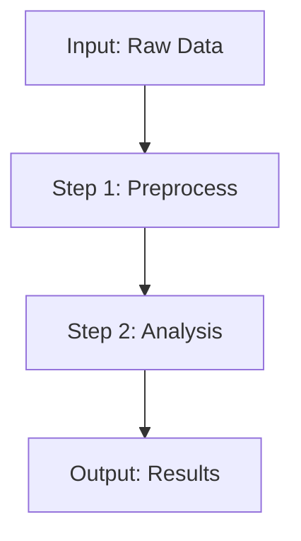
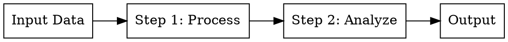
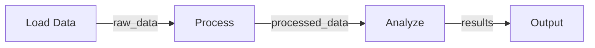

# Workflow Visualizer

Generate visual representations of workflows to help users understand the data flow and dependencies between steps.

## Input

Either:
- `workflow_json`: The JSON workflow specification (from extract-workflow-json)
- `workflow_code`: The Python workflow code (from extract-workflow-code)
- Or both

## Output Format

Multiple visualization formats:

### 1. Mermaid Flowchart


### 2. DAG Representation (Graphviz DOT)


### 3. ASCII Art (for terminal display)
```
┌─────────────┐
│  Input Data │
└──────┬──────┘
       │
       ▼
┌─────────────┐
│  Step 1     │
│  Process    │
└──────┬──────┘
       │
       ▼
┌─────────────┐
│  Step 2     │
│  Analyze    │
└──────┬──────┘
       │
       ▼
┌─────────────┐
│  Output     │
└─────────────┘
```

## Generation Rules

1. **Extract steps from input**: Parse workflow_json['steps'] or workflow_code class methods
2. **Identify dependencies**: Match output names from step N to input names in step N+1
3. **Draw data flow**: Show how data transforms through each step
4. **Highlight I/O**: Clearly mark external inputs and final outputs
5. **Keep it simple**: Max 10-15 nodes for readability

## Output Structure

```
=== MERMAID FLOWCHART ===
[mermaid code]

=== GRAPHVIZ DOT ===
[dot code]

=== ASCII DIAGRAM ===
[ascii art]
```

## Example

Input workflow with 3 steps:
1. Load data → 2. Process → 3. Analyze → Output

Output:

